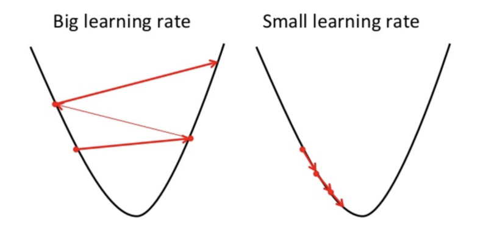

# Linear Regression using Batch Gradient Descent and Stochastic Gradient Descent

**Group Number:** χ  

**Group Members:**  
- Mst. Maris Islam - 2024000000012  
- Tanvir Rahyan Shayem - 2024000000035  
- Md. Monjurul Haque Moni - 2024000000038  
- Saykat Kumar Modak - 2023200000380  
- Niaj Mahamud - 2023200000289  
- Md. Golam Saroare Shuvo - 2022000000045  

**Submitted To:**  
[TMD] Tashreef Muhammad, Lecturer, Dept. of CSE, Southeast University, Bangladesh  

---

## Project Topic

Implement and explain **Stochastic Gradient Descent (SGD)** and **Batch Gradient Descent (BGD)** for **Linear Regression**, and compare their **convergence speed, accuracy, and performance** on a dataset (synthetic or real).  

This project demonstrates the implementation of **Linear Regression** using two types of gradient descent:

- **Batch Gradient Descent (BGD):** Updates parameters using all training samples at once. Produces smooth and stable convergence but can be slow for large datasets.  
- **Stochastic Gradient Descent (SGD):** Updates parameters **one sample at a time**, converging faster but with fluctuations near the minimum. Suitable for large datasets or streaming data.

---

## Objective

- Understand the difference between **BGD** and **SGD** for linear regression optimization.  
- Compare **convergence speed** and **accuracy** for both methods.  
- Implement both methods in **pure Python**, without external libraries.  
- Calculate and analyze **Mean Absolute Error (MAE)** and other error metrics.  
- Visualize convergence and parameter updates with **graphs**.

---

## About Linear Regression

**Linear Regression** is a supervised learning algorithm that predicts continuous values.  
It fits a line through data points using the equation:

\[
y = \theta_0 + \theta_1 x
\]

Where:  
- $\theta_0$ is the intercept  
- $\theta_1$ is the slope  
- $x$ is the input feature  
- $y$ is the predicted output  

**Goal:** Minimize the difference between predicted and actual values using a **cost function**:

\[
J(\theta) = \frac{1}{2m} \sum_{i=1}^m (h_\theta(x^{(i)}) - y^{(i)})^2
\]

**Image: Linear Regression Overview**  


---

## Gradient Descent

Gradient Descent is an optimization technique used to minimize the cost function **iteratively**:

\[
\theta := \theta - \alpha \nabla J(\theta)
\]

Where $\alpha$ is the **learning rate**, controlling the step size.  

### Types of Gradient Descent:

1. **Batch Gradient Descent (BGD)** – uses the full dataset per iteration.  
2. **Stochastic Gradient Descent (SGD)** – updates parameters per sample.  
3. **Mini-Batch Gradient Descent** – updates parameters using small subsets.

**Image: Gradient Descent Overview**  


---

## About the Code

The Python script `linear_regression_gd.py` is structured for clarity and learning:

1. **Synthetic Dataset:** Generates 100 random samples `(x, y)` with linear relation `y = 4 + 3x + noise`.  
2. **Parameter Initialization:** Random initial values for $\theta_0$ and $\theta_1$.  
3. **Batch Gradient Descent (BGD):**  
   - Updates parameters using **all samples per iteration**.  
   - Computes **Mean Absolute Error (MAE)** after training.  
   - Produces smooth convergence.  
4. **Stochastic Gradient Descent (SGD):**  
   - Updates parameters **one sample at a time per epoch**.  
   - Computes **Mean Absolute Error (MAE)** after training.  
   - Faster early convergence but fluctuates near minimum.  
5. **Comparison:** Displays convergence graphs and MAE for BGD and SGD.

**Error Visualization**  


---

## Key Functions

- `absolute_error(y_true, y_pred)`: Computes **Mean Absolute Error (MAE)**.  
- `batch_gradient_descent(X, y, learning_rate, n_iterations)`: Implements **BGD**.  
- `stochastic_gradient_descent(X, y, learning_rate, n_epochs)`: Implements **SGD**.  

---

## Convergence Analysis

- **BGD**:  
  - Smooth, stable cost decrease  
  - Predictable parameter updates  
  - Slower on large datasets

- **SGD**:  
  - Fast initial convergence  
  - Noisy updates  
  - Efficient for large datasets and streaming data

**Graphs** visualize the trade-offs between speed and stability:

- **Cost vs Iterations**  
- **Parameter (θ0, θ1) convergence**  

---

## How to Run

1. Clone the repository:  
```bash
git clone <your-repo-url>
